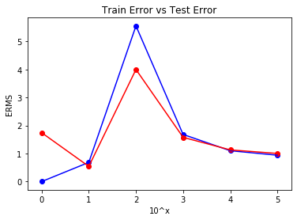

### a.	Generate 20 data pairs (X, Y) using y = sin(2*pi*X) + N 


```python
import numpy as np
import matplotlib.pyplot as plt
import pandas as pd 

pi = np.pi

x_train = (np.random.rand(10))
x_test = (np.random.rand(10))

x_train.sort()
x_test.sort()

print(x_train)
print(x_test)

n_train = (np.random.randn(10)) *.1
n_test = (np.random.randn(10)) *.1

#n_train.sort()
#n_test.sort()

print (n_train)
print (n_test)
```

    [0.07393674 0.12887724 0.29487367 0.46694139 0.56163752 0.57237979
     0.63797124 0.72342788 0.9152379  0.91819763]
    [0.18181596 0.29984681 0.44713304 0.47535811 0.58992219 0.72139859
     0.74315824 0.75465909 0.78250802 0.90683796]
    [ 0.09784176  0.06577599 -0.02739174 -0.07409742 -0.04053794 -0.07966402
     -0.01415504 -0.03253079 -0.13033747 -0.22097928]
    [-0.06679267  0.14594941  0.13734051  0.0200727   0.14259551  0.09108109
      0.01548455 -0.10223292  0.115186   -0.18256138]
    


```python
# Calculate y using given formula

y_train = []
y_test = []

for i in range (0, len(x_train)):    
    y_train.append( np.sin(2*pi*x_train[i]) + n_train[i])

for i in range (0, len(x_test)):    
    y_test.append( np.sin(2*pi*x_test[i]) + n_test[i])
    
print (y_train)
print (y_test)
```

    [0.5458696822664747, 0.7898973706633675, 0.9331230974588547, 0.13212556006524062, -0.4182091386173605, -0.5189248060527326, -0.7764806082125469, -1.0186257275830854, -0.6380917147994288, -0.7126256798978138]
    [0.8428335173053534, 1.0973029299223134, 0.46343844914404736, 0.17428440122773464, -0.3928184175763704, -0.8928148410591978, -0.983591609509404, -1.1018044720856301, -0.8640265832683752, -0.7350561595209225]
    


```python
# print (x,y) pair

xy_train = []
xy_test = []

for i in range (0, len(x_train)):
    xy_train.append([x_train[i], y_train[i]])
    
for i in range (0, len(x_test)):
    xy_test.append([x_test[i], y_test[i]])
    
print (xy_train)
print (xy_test)
```

    [[0.07393674298395059, 0.5458696822664747], [0.12887723964405173, 0.7898973706633675], [0.2948736687947554, 0.9331230974588547], [0.4669413872432395, 0.13212556006524062], [0.561637515357176, -0.4182091386173605], [0.5723797936032003, -0.5189248060527326], [0.6379712385257792, -0.7764806082125469], [0.7234278833996282, -1.0186257275830854], [0.9152378986009565, -0.6380917147994288], [0.9181976329352635, -0.7126256798978138]]
    [[0.1818159569698632, 0.8428335173053534], [0.29984680589933776, 1.0973029299223134], [0.4471330366296955, 0.46343844914404736], [0.47535810993745875, 0.17428440122773464], [0.589922187261794, -0.3928184175763704], [0.7213985869785678, -0.8928148410591978], [0.7431582403514103, -0.983591609509404], [0.7546590912966487, -1.1018044720856301], [0.7825080243905452, -0.8640265832683752], [0.9068379608923054, -0.7350561595209225]]
    

### b. Using Root Mean Square, find weights and perform fitting


```python
# Fitting Linear Regression to the dataset 
from sklearn.linear_model import LinearRegression 

# Fitting Polynomial Regression to the dataset 
from sklearn.preprocessing import PolynomialFeatures 

x_train = x_train.reshape(-1,1)
x_test = x_test.reshape(-1,1)

print (x_train)
print (x_test)
```

    [[0.07393674]
     [0.12887724]
     [0.29487367]
     [0.46694139]
     [0.56163752]
     [0.57237979]
     [0.63797124]
     [0.72342788]
     [0.9152379 ]
     [0.91819763]]
    [[0.18181596]
     [0.29984681]
     [0.44713304]
     [0.47535811]
     [0.58992219]
     [0.72139859]
     [0.74315824]
     [0.75465909]
     [0.78250802]
     [0.90683796]]
    


```python
# Perform fitting for Degree = 0
poly0 = PolynomialFeatures(degree=0) 
X_poly0 = poly0.fit_transform(x_train)
X_poly_test0 = poly0.fit_transform(x_test)
poly0.fit(X_poly0, y_train)
lin0 = LinearRegression() 
lin0.fit(X_poly0, y_train)


# Perform fitting for Degree = 1
poly1 = PolynomialFeatures(degree=1) 
X_poly1 = poly1.fit_transform(x_train)
X_poly_test1 = poly1.fit_transform(x_test)
poly1.fit(X_poly1, y_train)
lin1 = LinearRegression() 
lin1.fit(X_poly1, y_train)

# Perform fitting for Degree = 2
poly2 = PolynomialFeatures(degree=2) 
X_poly2 = poly2.fit_transform(x_train)
X_poly_test2 = poly2.fit_transform(x_test)
poly2.fit(X_poly2, y_train)
lin2 = LinearRegression() 
lin2.fit(X_poly2, y_train)

# Perform fitting for Degree = 3
poly3 = PolynomialFeatures(degree=3) 
X_poly3 = poly3.fit_transform(x_train)
X_poly_test3 = poly3.fit_transform(x_test)
poly3.fit(X_poly3, y_train)
lin3 = LinearRegression() 
lin3.fit(X_poly3, y_train)

# Perform fitting for Degree = 4
poly4 = PolynomialFeatures(degree=4) 
X_poly4 = poly4.fit_transform(x_train)
X_poly_test4 = poly4.fit_transform(x_test)
poly4.fit(X_poly4, y_train)
lin4 = LinearRegression() 
lin4.fit(X_poly4, y_train)

# Perform fitting for Degree = 5
poly5 = PolynomialFeatures(degree=5) 
X_poly5 = poly5.fit_transform(x_train)
X_poly_test5 = poly5.fit_transform(x_test)
poly5.fit(X_poly5, y_train)
lin5 = LinearRegression() 
lin5.fit(X_poly5, y_train)

# Perform fitting for Degree = 6
poly6 = PolynomialFeatures(degree=6) 
X_poly6 = poly6.fit_transform(x_train)
X_poly_test6 = poly6.fit_transform(x_test)
poly6.fit(X_poly6, y_train)
lin6 = LinearRegression() 
lin6.fit(X_poly6, y_train)

# Perform fitting for Degree = 7
poly7 = PolynomialFeatures(degree=7) 
X_poly7 = poly7.fit_transform(x_train)
X_poly_test7 = poly7.fit_transform(x_test)
poly7.fit(X_poly7, y_train)
lin7 = LinearRegression() 
lin7.fit(X_poly7, y_train)

# Perform fitting for Degree = 8
poly8 = PolynomialFeatures(degree=8) 
X_poly8 = poly8.fit_transform(x_train)
X_poly_test8 = poly8.fit_transform(x_test)
poly8.fit(X_poly8, y_train)
lin8 = LinearRegression() 
lin8.fit(X_poly8, y_train)

# Perform fitting for Degree = 9
poly9 = PolynomialFeatures(degree=9) 
X_poly9 = poly9.fit_transform(x_train)
X_poly_test9 = poly9.fit_transform(x_test)
poly9.fit(X_poly9, y_train)
lin9 = LinearRegression() 
lin9.fit(X_poly9, y_train)
```


    LinearRegression(copy_X=True, fit_intercept=True, n_jobs=None, normalize=False)


```python
# Find Root Mean Square Error for all orders
from sklearn.metrics import mean_squared_error
from sklearn.pipeline import make_pipeline

# Find RMSE for Train Set
y_poly_pred0 = lin0.predict(X_poly0)
rmse_train0 = np.sqrt(mean_squared_error(y_train, y_poly_pred0))

y_poly_pred1 = lin1.predict(X_poly1)
rmse_train1 = np.sqrt(mean_squared_error(y_train, y_poly_pred1))

y_poly_pred2 = lin2.predict(X_poly2)
rmse_train2 = np.sqrt(mean_squared_error(y_train, y_poly_pred2))

y_poly_pred3 = lin3.predict(X_poly3)
rmse_train3 = np.sqrt(mean_squared_error(y_train, y_poly_pred3))

y_poly_pred4 = lin4.predict(X_poly4)
rmse_train4 = np.sqrt(mean_squared_error(y_train, y_poly_pred4))

y_poly_pred5 = lin5.predict(X_poly5)
rmse_train5 = np.sqrt(mean_squared_error(y_train, y_poly_pred5))

y_poly_pred6 = lin6.predict(X_poly6)
rmse_train6 = np.sqrt(mean_squared_error(y_train, y_poly_pred6))

y_poly_pred7 = lin7.predict(X_poly7)
rmse_train7 = np.sqrt(mean_squared_error(y_train, y_poly_pred7))

y_poly_pred8 = lin8.predict(X_poly8)
rmse_train8 = np.sqrt(mean_squared_error(y_train, y_poly_pred8))

y_poly_pred9 = lin9.predict(X_poly9)
rmse_train9 = np.sqrt(mean_squared_error(y_train, y_poly_pred9))

# Print RMS for Train Set
print("RMSE Train:")
print(rmse_train0)
print(rmse_train1)
print(rmse_train2)
print(rmse_train3)
print(rmse_train4)
print(rmse_train5)
print(rmse_train6)
print(rmse_train7)
print(rmse_train8)
print(rmse_train9)

rmse_train = [rmse_train0, rmse_train1, rmse_train2, rmse_train3, rmse_train4, rmse_train5, rmse_train6, rmse_train7, rmse_train8, rmse_train9]

# Find RMSE for Test Set
y_predict0 = lin0.predict(X_poly_test0)
rmse_test0 = np.sqrt(mean_squared_error(y_test, y_predict0))

y_predict1 = lin1.predict(X_poly_test1)
rmse_test1 = np.sqrt(mean_squared_error(y_test, y_predict1))

y_predict2 = lin2.predict(X_poly_test2)
rmse_test2 = np.sqrt(mean_squared_error(y_test, y_predict2))

y_predict3 = lin3.predict(X_poly_test3)
rmse_test3 = np.sqrt(mean_squared_error(y_test, y_predict3))

y_predict4 = lin4.predict(X_poly_test4)
rmse_test4 = np.sqrt(mean_squared_error(y_test, y_predict4))

y_predict5 = lin5.predict(X_poly_test5)
rmse_test5 = np.sqrt(mean_squared_error(y_test, y_predict5))

y_predict6 = lin6.predict(X_poly_test6)
rmse_test6 = np.sqrt(mean_squared_error(y_test, y_predict6))

y_predict7 = lin7.predict(X_poly_test7)
rmse_test7 = np.sqrt(mean_squared_error(y_test, y_predict7))

y_predict8 = lin8.predict(X_poly_test8)
rmse_test8 = np.sqrt(mean_squared_error(y_test, y_predict8))

y_predict9 = lin9.predict(X_poly_test9)
rmse_test9 = np.sqrt(mean_squared_error(y_test, y_predict9))

# Print RMS for Train Set
print("RMSE Test:")
print(rmse_test0)
print(rmse_test1)
print(rmse_test2)
print(rmse_test3)
print(rmse_test4)
print(rmse_test5)
print(rmse_test6)
print(rmse_test7)
print(rmse_test8)
print(rmse_test9)

rmse_test = [rmse_test0, rmse_test1, rmse_test2, rmse_test3, rmse_test4, rmse_test5, rmse_test6, rmse_test7, rmse_test8, rmse_test9]
```

    RMSE Train:
    0.6728219162227975
    0.33218769405458426
    0.31728850149910615
    0.03592835640903712
    0.03512951606462187
    0.02237873167992152
    0.022366530151685025
    0.019526586954849795
    0.010656388306060886
    4.93922291351634e-10
    RMSE Test:
    0.7782967818695236
    0.3869427561674147
    0.4026710400843605
    0.1600560645845896
    0.15750983044045558
    0.13186068105507284
    0.13138546188848868
    0.14090127985858683
    0.1441675897357853
    1.7430464668214063
    


```python
# Print intercepts for all 

intc0 = lin0.intercept_.copy()
intc1 = lin1.intercept_.copy()
intc3 = lin3.intercept_.copy()
intc9 = lin9.intercept_.copy()

print(intc0)
print(intc1)
print(intc3)
print(intc9)
```

    -0.16819419647090303
    0.9414076957446746
    -0.18649375077900096
    158.40823185811297
    


```python
# Print coefficients for all orders

coef0 = lin0.coef_.copy()
coef1 = lin1.coef_.copy()
coef3 = lin3.coef_.copy()
coef9 = lin9.coef_.copy()

print(coef0)
print(coef1)
print(coef3)
print(coef9)
```

    [0.]
    [ 0.         -2.09616676]
    [  0.          12.11377329 -35.68374472  23.88068944]
    [ 0.00000000e+00 -5.33532922e+03  6.88209646e+04 -4.53510416e+05
      1.73249722e+06 -4.06852072e+06  5.96625687e+06 -5.32789270e+06
      2.65085939e+06 -5.63395377e+05]
    


```python
# Replace first value of coeff with intercept

coef0[0] = intc0
coef1[0] = intc1
coef3[0] = intc3
coef9[0] = intc9
```

### c. Display weights in table


```python
# Display weights in table

from pandas import DataFrame

weights = {'M=0': [coef0[0], '', '', '', '', '', '', '', '', ''],
       'M=1': [coef1[0], coef1[1], '', '', '', '', '', '', '', ''],
       'M=3': [coef3[0], coef3[1], coef3[2], coef3[3], '', '', '', '', '', ''],
       'M=9': [coef9[0], coef9[1], coef9[2], coef9[3], coef9[4], coef9[5], coef9[6], coef9[7], coef9[8], coef9[9]]}

# Creating DataFrame
weightsData = DataFrame(weights)

# Display table
weightsData
```


<div>
<style scoped>
    .dataframe tbody tr th:only-of-type {
        vertical-align: middle;
    }

    .dataframe tbody tr th {
        vertical-align: top;
    }

    .dataframe thead th {
        text-align: right;
    }
</style>
<table border="1" class="dataframe">
  <thead>
    <tr style="text-align: right;">
      <th></th>
      <th>M=0</th>
      <th>M=1</th>
      <th>M=3</th>
      <th>M=9</th>
    </tr>
  </thead>
  <tbody>
    <tr>
      <td>0</td>
      <td>-0.168194</td>
      <td>0.941408</td>
      <td>-0.186494</td>
      <td>1.584082e+02</td>
    </tr>
    <tr>
      <td>1</td>
      <td></td>
      <td>-2.09617</td>
      <td>12.1138</td>
      <td>-5.335329e+03</td>
    </tr>
    <tr>
      <td>2</td>
      <td></td>
      <td></td>
      <td>-35.6837</td>
      <td>6.882096e+04</td>
    </tr>
    <tr>
      <td>3</td>
      <td></td>
      <td></td>
      <td>23.8807</td>
      <td>-4.535104e+05</td>
    </tr>
    <tr>
      <td>4</td>
      <td></td>
      <td></td>
      <td></td>
      <td>1.732497e+06</td>
    </tr>
    <tr>
      <td>5</td>
      <td></td>
      <td></td>
      <td></td>
      <td>-4.068521e+06</td>
    </tr>
    <tr>
      <td>6</td>
      <td></td>
      <td></td>
      <td></td>
      <td>5.966257e+06</td>
    </tr>
    <tr>
      <td>7</td>
      <td></td>
      <td></td>
      <td></td>
      <td>-5.327893e+06</td>
    </tr>
    <tr>
      <td>8</td>
      <td></td>
      <td></td>
      <td></td>
      <td>2.650859e+06</td>
    </tr>
    <tr>
      <td>9</td>
      <td></td>
      <td></td>
      <td></td>
      <td>-5.633954e+05</td>
    </tr>
  </tbody>
</table>
</div>


### d. Draw a chart of fit data


```python
# Data Chart for Degree = 0
random100 = np.arange(0,1,.01)
plt.scatter(x_train, y_train, color = 'blue') 
plt.plot(np.arange(0,1,.01), np.sin(2*pi*random100), color = 'green')
plt.plot(x_train, lin0.predict(X_poly0), color = 'red') 
plt.title('Polynomial Regression (M=0)') 
plt.xlabel('x') 
plt.ylabel('t') 
plt.show()


# Data Chart for Degree = 1
random100 = np.arange(0,1,.01)
plt.scatter(x_train, y_train, color = 'blue') 
plt.plot(np.arange(0,1,.01), np.sin(2*pi*random100), color = 'green')
plt.plot(x_train, lin1.predict(X_poly1), color = 'red') 
plt.title('Polynomial Regression (M=1)') 
plt.xlabel('x') 
plt.ylabel('t') 
plt.show() 


# Data Chart for Degree = 3
random100 = np.arange(0,1,.01)
plt.scatter(x_train, y_train, color = 'blue') 
plt.plot(np.arange(0,1,.01), np.sin(2*pi*random100), color = 'green')
plt.plot(x_train, lin3.predict(X_poly3), color = 'red') 
plt.title('Polynomial Regression (M=3)') 
plt.xlabel('x') 
plt.ylabel('t') 
plt.show()


# Data Chart for Degree = 9
random100 = np.arange(0,1,.01)
plt.scatter(x_train, y_train, color = 'blue') 
plt.plot(np.arange(0,1,.01), np.sin(2*pi*random100), color = 'green')
plt.plot(x_train, lin9.predict(X_poly9), color = 'red') 
plt.title('Polynomial Regression (M=9)') 
plt.xlabel('x') 
plt.ylabel('t') 
plt.show() 
```


### e.	Draw train error vs test error


```python
# Train Error vs Test Error

random10 = np.arange(0,10,1)
plt.scatter(random10, rmse_train, color = 'blue') 
plt.scatter(random10, rmse_test, color = 'red') 

plt.plot(rmse_train, color = 'blue') 
plt.plot(rmse_test, color = 'red') 

plt.title('Train Error vs Test Error') 
plt.xlabel('M') 
plt.ylabel('ERMS') 
plt.show() 
```


### f. Generate new 100 values


```python
# Generate new 100 values, perform fitting and plot data chart for degree 9

x_new = (np.random.rand(100))
x_new.sort()
x_new = x_new.reshape(-1,1)

n_new = (np.random.randn(100)) * .3

y_new = []
for i in range (0, len(x_new)):    
    y_new.append( np.sin(2*pi*x_new[i]) + n_new[i])
    
# Perform fitting for Degree = 9
poly_new9 = PolynomialFeatures(degree=9) 
X_poly_new9 = poly_new9.fit_transform(x_new)
poly_new9.fit(X_poly_new9, y_new)
lin_new9 = LinearRegression() 
lin_new9.fit(X_poly_new9, y_new)

# Data Chart for Degree = 9
random100 = np.arange(0,1,.01)
plt.scatter(x_new, y_new, color = 'blue') 
plt.plot(np.arange(0,1,.01), np.sin(2*pi*random100), color = 'green')
plt.plot(x_new, lin_new9.predict(X_poly_new9), color = 'red') 
plt.title('Polynomial Regression 100 new values (M=9)') 
plt.xlabel('x') 
plt.ylabel('t') 
plt.show() 
```


### g. Regularize using the sum of weights and h. Draw chart for given lambda values


```python
from sklearn.preprocessing import StandardScaler
from sklearn.linear_model import Ridge
from sklearn.pipeline import Pipeline
from sklearn.pipeline import make_pipeline
```


```python
# Draw chart for lambda = 1
mlambda=1

plt.figure(figsize=(20, 10))
steps = [
('scalar', StandardScaler()),
('poly', PolynomialFeatures(degree=9)),
('model', Ridge(alpha=mlambda, fit_intercept=True))
]

ridge_pipe = Pipeline(steps)
ridge_pipe.fit(x_train, y_train)
    
axis = plt.subplot(3, 2, 1)
plt.setp(axis, xticks=(), yticks=())
plt.plot(x_test, ridge_pipe.predict(x_test), color = 'blue', label="lambda = 1")
plt.plot(x_test, y_test, color = 'red', label="Formula")
plt.scatter(x_train, y_train, edgecolor='r', s=20, label="Train Set")
plt.xlabel("x")
plt.ylabel("t")
plt.legend(loc="lower left") 
plt.show()
```


```python
# Draw chart for lambda = 1/10
mlambda=1/10

plt.figure(figsize=(20, 10))
steps = [
('scalar', StandardScaler()),
('poly', PolynomialFeatures(degree=9)),
('model', Ridge(alpha=mlambda, fit_intercept=True))
]

ridge_pipe = Pipeline(steps)
ridge_pipe.fit(x_train, y_train)
    
axis = plt.subplot(3, 2, 1)
plt.setp(axis, xticks=(), yticks=())
plt.plot(x_test, ridge_pipe.predict(x_test), color = 'blue', label="lambda = 1/10")
plt.plot(x_test, y_test, color = 'red', label="Formula")
plt.scatter(x_train, y_train, edgecolor='r', s=20, label="Train Set")
plt.xlabel("x")
plt.ylabel("t")
plt.legend(loc="lower left") 
plt.show()
```


```python
# Draw chart for lambda = 1/100
mlambda=1/100

plt.figure(figsize=(20, 10))
steps = [
('scalar', StandardScaler()),
('poly', PolynomialFeatures(degree=9)),
('model', Ridge(alpha=mlambda, fit_intercept=True))
]

ridge_pipe = Pipeline(steps)
ridge_pipe.fit(x_train, y_train)
    
axis = plt.subplot(3, 2, 1)
plt.setp(axis, xticks=(), yticks=())
plt.plot(x_test, ridge_pipe.predict(x_test), color = 'blue', label="lambda = 1/100")
plt.plot(x_test, y_test, color = 'red', label="Formula")
plt.scatter(x_train, y_train, edgecolor='r', s=20, label="Train Set")
plt.xlabel("x")
plt.ylabel("t")
plt.legend(loc="lower left") 
plt.show()
```


```python
# Draw chart for lambda = 1/1000
mlambda=1/1000

plt.figure(figsize=(20, 10))
steps = [
('scalar', StandardScaler()),
('poly', PolynomialFeatures(degree=9)),
('model', Ridge(alpha=mlambda, fit_intercept=True))
]

ridge_pipe = Pipeline(steps)
ridge_pipe.fit(x_train, y_train)
    
axis = plt.subplot(3, 2, 1)
plt.setp(axis, xticks=(), yticks=())
plt.plot(x_test, ridge_pipe.predict(x_test), color = 'blue', label="lambda = 1/1000")
plt.plot(x_test, y_test, color = 'red', label="Formula")
plt.scatter(x_train, y_train, edgecolor='r', s=20, label="Train Set")
plt.xlabel("x")
plt.ylabel("t")
plt.legend(loc="lower left") 
plt.show()
```


```python
# Draw chart for lambda = 1/10000
mlambda=1/10000

plt.figure(figsize=(20, 10))
steps = [
('scalar', StandardScaler()),
('poly', PolynomialFeatures(degree=9)),
('model', Ridge(alpha=mlambda, fit_intercept=True))
]

ridge_pipe = Pipeline(steps)
ridge_pipe.fit(x_train, y_train)
    
axis = plt.subplot(3, 2, 1)
plt.setp(axis, xticks=(), yticks=())
plt.plot(x_test, ridge_pipe.predict(x_test), color = 'blue', label="lambda = 1/10000")
plt.plot(x_test, y_test, color = 'red', label="Formula")
plt.scatter(x_train, y_train, edgecolor='r', s=20, label="Train Set")
plt.xlabel("x")
plt.ylabel("t")
plt.legend(loc="lower left") 
plt.show()
```


```python
# Draw chart for lambda = 1/100000
mlambda=1/100000

plt.figure(figsize=(20, 10))
steps = [
('scalar', StandardScaler()),
('poly', PolynomialFeatures(degree=9)),
('model', Ridge(alpha=mlambda, fit_intercept=True))
]

ridge_pipe = Pipeline(steps)
ridge_pipe.fit(x_train, y_train)
    
axis = plt.subplot(3, 2, 1)
plt.setp(axis, xticks=(), yticks=())
plt.plot(x_test, ridge_pipe.predict(x_test), color = 'blue', label="lambda = 1/100000")
plt.plot(x_test, y_test, color = 'red', label="Formula")
plt.scatter(x_train, y_train, edgecolor='r', s=20, label="Train Set")
plt.xlabel("x")
plt.ylabel("t")
plt.legend(loc="lower left") 
plt.show()
```


### i. Draw Test and Train Error according to lamda 


```python
# Perform fitting for lambda = 1 and Degree = 9
poly_1 = PolynomialFeatures(degree=9) 
X_poly_1 = poly_1.fit_transform(x_train)
X_poly_test_1 = poly_1.fit_transform(x_test)
poly_1.fit(X_poly_1, y_train)
lin_1 = Ridge(alpha=np.log(1), fit_intercept=True) 
lin_1.fit(X_poly_1, y_train)

# Perform fitting for lambda = 10 and Degree = 9
poly_10 = PolynomialFeatures(degree=9) 
X_poly_10 = poly_10.fit_transform(x_train)
X_poly_test_10 = poly_10.fit_transform(x_test)
poly_10.fit(X_poly_10, y_train)
lin_10 = Ridge(alpha=np.log(1/10), fit_intercept=True) 
lin_10.fit(X_poly_10, y_train)

# Perform fitting for lambda = 100 and Degree = 9
poly_100 = PolynomialFeatures(degree=9) 
X_poly_100 = poly_100.fit_transform(x_train)
X_poly_test_100 = poly_100.fit_transform(x_test)
poly_100.fit(X_poly_100, y_train)
lin_100 = Ridge(alpha=np.log(1/100), fit_intercept=True) 
lin_100.fit(X_poly_100, y_train)

# Perform fitting for lambda = 1000 and Degree = 9
poly_1000 = PolynomialFeatures(degree=9) 
X_poly_1000 = poly_1000.fit_transform(x_train)
X_poly_test_1000 = poly_1000.fit_transform(x_test)
poly_1000.fit(X_poly_1000, y_train)
lin_1000 = Ridge(alpha=np.log(1/1000), fit_intercept=True) 
lin_1000.fit(X_poly_1000, y_train)

# Perform fitting for lambda = 10000 and Degree = 9
poly_10000 = PolynomialFeatures(degree=9) 
X_poly_10000 = poly_10000.fit_transform(x_train)
X_poly_test_10000 = poly_10000.fit_transform(x_test)
poly_10000.fit(X_poly_10000, y_train)
lin_10000 = Ridge(alpha=np.log(1/10000), fit_intercept=True) 
lin_10000.fit(X_poly_10000, y_train)

# Perform fitting for lambda = 100000 and Degree = 9
poly_100000 = PolynomialFeatures(degree=9) 
X_poly_100000 = poly_100000.fit_transform(x_train)
X_poly_test_100000 = poly_100000.fit_transform(x_test)
poly_100000.fit(X_poly_100000, y_train)
lin_100000 = Ridge(alpha=np.log(1/100000), fit_intercept=True) 
lin_100000.fit(X_poly_100000, y_train)
```


    Ridge(alpha=-11.512925464970229, copy_X=True, fit_intercept=True, max_iter=None,
          normalize=False, random_state=None, solver='auto', tol=0.001)


```python
y_poly_pred_1 = lin_1.predict(X_poly_1)
rmse_train_1 = np.sqrt(mean_squared_error(y_train, y_poly_pred_1))

y_poly_pred_10 = lin_10.predict(X_poly_10)
rmse_train_10 = np.sqrt(mean_squared_error(y_train, y_poly_pred_10))

y_poly_pred_100 = lin_100.predict(X_poly_100)
rmse_train_100 = np.sqrt(mean_squared_error(y_train, y_poly_pred_100))

y_poly_pred_1000 = lin_1000.predict(X_poly_1000)
rmse_train_1000 = np.sqrt(mean_squared_error(y_train, y_poly_pred_1000))

y_poly_pred_10000 = lin_10000.predict(X_poly_10000)
rmse_train_10000 = np.sqrt(mean_squared_error(y_train, y_poly_pred_10000))

y_poly_pred_100000 = lin_100000.predict(X_poly_100000)
rmse_train_100000 = np.sqrt(mean_squared_error(y_train, y_poly_pred_100000))

print(rmse_train_1)
print(rmse_train_10)
print(rmse_train_100)
print(rmse_train_1000)
print(rmse_train_10000)
print(rmse_train_100000)

rmse_train_new = [rmse_train_1, rmse_train_10, rmse_train_100, rmse_train_1000, rmse_train_10000, rmse_train_100000]

y_predict_1 = lin_1.predict(X_poly_test_1)
rmse_test_1 = np.sqrt(mean_squared_error(y_test, y_predict_1))

y_predict_10 = lin_10.predict(X_poly_test_10)
rmse_test_10 = np.sqrt(mean_squared_error(y_test, y_predict_10))

y_predict_100 = lin_100.predict(X_poly_test_100)
rmse_test_100 = np.sqrt(mean_squared_error(y_test, y_predict_100))

y_predict_1000 = lin_1000.predict(X_poly_test_1000)
rmse_test_1000 = np.sqrt(mean_squared_error(y_test, y_predict_1000))

y_predict_10000 = lin_10000.predict(X_poly_test_10000)
rmse_test_10000 = np.sqrt(mean_squared_error(y_test, y_predict_10000))

y_predict_100000 = lin_100000.predict(X_poly_test_100000)
rmse_test_100000 = np.sqrt(mean_squared_error(y_test, y_predict_100000))

rmse_test_new = [rmse_test_1, rmse_test_10, rmse_test_100, rmse_test_1000, rmse_test_10000, rmse_test_100000]

print(rmse_test_1)
print(rmse_test_10)
print(rmse_test_100)
print(rmse_test_1000)
print(rmse_test_10000)
print(rmse_test_100000)
```

    3.149484569912298e-10
    0.6839478683540193
    5.552566750215553
    1.6803835550464734
    1.1003866941640865
    0.9396372088350134
    1.7430464668658117
    0.5409141475091542
    3.99820174330127
    1.5776477381024112
    1.1298834813420526
    1.0026429613848387
    


```python
# Train Error vs Test Error

random10 = np.arange(0,6,1)
plt.scatter(random10, rmse_train_new, color = 'blue') 
plt.scatter(random10, rmse_test_new, color = 'red') 

plt.plot(rmse_train_new, color = 'blue') 
plt.plot(rmse_test_new, color = 'red') 

plt.title('Train Error vs Test Error') 
plt.xlabel('10^x') 
plt.ylabel('ERMS') 
plt.show() 
```





### j.	Based on the best test performance, what is your model? 
Best model is where lambda = 1


```python

```


```python

```
